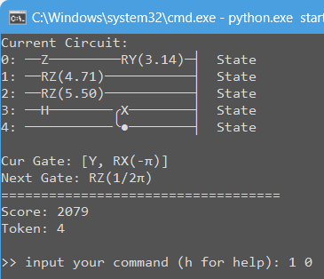
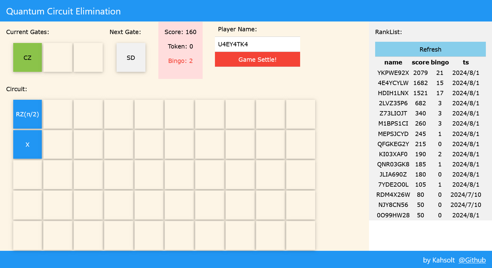

# Quantum-Circuit-Elimination

    The Quantum Circuit Elimination game, learning quantum logical circuit with fun :)

----

**Quantum Circuit Elimination** is inspired by Quantum Tetris, but actually is a Block Elimination Puzzle, plus a little bit 2048 game.  
This project is for the quantum challenge 2024 from [第一届“天衍”量子计算挑战先锋赛-大众组](https://qc.zdxlz.com/learn/#/megagame/megagameDetail?id=1801135605315321857&lang=zh)  


#### Screenshot

⚪ CUI



⚪ WebUI (⚠ still under development...)




#### How to start

ℹ So far only the ugly CUI client works... 😓

- `cd server; python server.py`
- `cd client\cui; python start.py`
  - enter `h` for command help
  - run in debug mode: `python start.py --debug`


#### GamePlay

- You will face with a 5-qubits 10-clock **quantum logical circuit**, and an infinite sequence of random spawned **quantum logical gates**, mimicking the traditional Tetris board and pieces
- You are asked to select proper gates and **append** to the circuit, and the score is counted
- When two rotation gates of the same axis meet, they'll be **merged** with a score ratio x1.5
- When two gates inversion (dagger!) of each other meet, they will be **eliminated (Bingo!)** with score ratio x3 🎉🎉
- Every 5 bingos, you'll have an additional **removal token**. You can use it to remove an arbitrary gate!
- Note that SWAP is NOT the the quantum SWAP gate, it can swap locations of two single-qubit gates!

<details>
<summary>Notes for the 1st gameplay design draft :(</summary>
In the original design, if any sub-part of the circuit is equivalent to an identity matrix, it will **collapse** and we call this bingo!  
Every 5 bingos, the player will be rewarded with a **hint token** to get hints about the placements.  
However, implementing this requires O(2^n) computations and is extremely annoying... we have to step back.  
</details>


#### References

⚪ Other Tetris-inspired quantum games

- Quantum Games and Interactive Tools for Quantum Technologies Outreach and Education: https://arxiv.org/pdf/2202.07756.pdf
- Catris (Quantum Game Jam 2015)
  - online play: https://antworks.itch.io/catris
- Quantum Tetris (2019)
  - repo: https://github.com/dartmouth-cs98/Quantum-Tetris
  - blog: https://medium.com/dartmouth-cs98/quantum-tetris-6452a0c96227
- Quantum Tetris (Quantum Design Jam 2021 October)
  - index page: https://olivierbrcknr.github.io/quantum-tetris
  - repo: https://github.com/olivierbrcknr/quantum-tetris
  - blog
    - https://workingnotworking.com/projects/291740-quantum-tetris
    - https://www.lariemilio.com/quantum
- QuanTetrum (Quantum Game Hackathon 2021)
  - repo: https://github.com/darkknightgit/QuanTetrum
  - demo video: https://www.youtube.com/watch?v=DlKU3qC7mQc

If you find this work useful, please give a star ⭐ and cite~

```
@misc{kahsolt2024,
  author = {Kahsolt},
  title  = {Quantum-Circuit-Elimination},
  howpublished = {\url{https://github.com/Kahsolt/Quantum-Circuit-Elimination}}
  month  = {July},
  year   = {2024}
}
```

----
by Armit
2024/07/07
