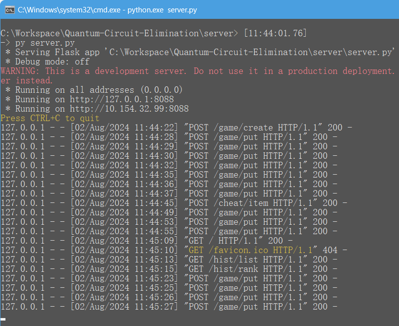

# Quantum Circuit Elimination 设计案

    确实，这就只是一个很简单的消消乐游戏而已(  

### 基本信息

名称: Quantum Circuit Elimination (量子线路消消乐)  
简介: 基于量子线路的消消乐小游戏，化简消除量子门以换取更多积分！  
队名: 大群与你同在  

### 选题概述

出于教育目的而面向量子计算初学者，我们使用基于逻辑门的量子计算 (gated-quantum computing) 中最常见的量子线路 (quantum circuit) 这一工具作为游戏表现的主要载体，引导玩家熟悉量子线路构建、认识各种量子逻辑门、理解不同门之间的关系，为以后**量子线路化简、量子线路等价性验证**等相关研究积累经验基础。

### 方案设计

⚠ 我们最终实现的是简化版设计，原始设计请参考 👉 [补充-原始设计案](#补充-原始设计案)

我们的玩法设计主要有四个方面：

- 原始设计灵感来自于**俄罗斯方块 (Tetris, Quantum-Tetris)** 和 **积木叠叠乐 (Jenga)** 等消除类游戏，即考虑使用量子线路-量子逻辑门来类比此类游戏中的空布局-方块实体：玩家需要将一串随机生成的量子门逐个放入初始空线路中，同一条线缆上位置相邻且互逆关系的门方块会被 **消除(eliminate)**，同时产生积分和bingo计数
- 考虑到量子旋转门系列 `RX/RY/RZ/X/Y/Z/S/T/SD/TD` 有同类角度合并的特性，我们结合 **2048** 等凑数字游戏的设计，引入了 **融合(fuse)** 的概念：同一条线缆上两个同类旋转门相邻放置时会被缩并为一个门，同时产生积分
- **SWAP门** 在标准量子计算中可用于交换两个比特的态，但它的这个语义对于我们的游戏玩法没有帮助，我们将其重定义为 "交换线路中任意指定位置的两个单比特门" 的操作
- 按积分的档级扩充当前可拖放门的槽位数 (初始1最大3)
- 按bingo计数的一定比例发放**删除小道具**，可用于强制剔除线路中指定位置的门方块，以渡过险境

综合上述玩法规则，玩家通过调整放置门方块的策略，可以尽力保持当前线路深度最小化，以有机会获得更多积分。我们记录玩家的游玩记录，并制作最高分榜单列表以供展示。

#### 补充: 原始设计案

在初版设计中，我们希望 (结合专业组赛题二) 做一个更通用的自动量子线路化简/线路重写的状态机，即 **消除** 的概念被定义为 **"玩家在线路中增加/删除量子门后，若完整线路中存在某个子线路的对应酉矩阵为单位阵，则消去这个子线路"**。

但在实现时我们发现这个问题似乎是 NP 甚至 NP-hard 的，除了穷举之外没有高效算法来剔除所有等价于恒等操作的子线路。于是我们考虑将方案退化为基于规则的模式匹配系统 (诸如 `H-X-H = Z`, `H-CZ-H = CNOT` 等)，但构建这样的系统需要积累大量重写规则库/等价规则库，并且搜索-匹配的计算开销仍然很大。经讨论评估，在有限的比赛时间内我们无法完成上述规则匹配系统，故最终将设计简化到只考虑相邻门的互逆 dagger 关系。

### 代码实现

基于 client-server 模式实现，见[本仓库](https://github.com/Kahsolt/Quantum-Circuit-Elimination)的 [server](../server/) 和 [client](../client/) 目录；通信协议定义详见 [server/doc/doc.md](../server/doc/doc.md)

### 运行结果示例

ℹ 各游戏规则的具体运行示例可参考 [report.pdf](./report.pdf)

⚪ 客户端

命令行应用程序 CUI

网页端应用程序 WebUI (功能暂不全，仍在完善中...)

⚪ 服务端

<!--  -->

